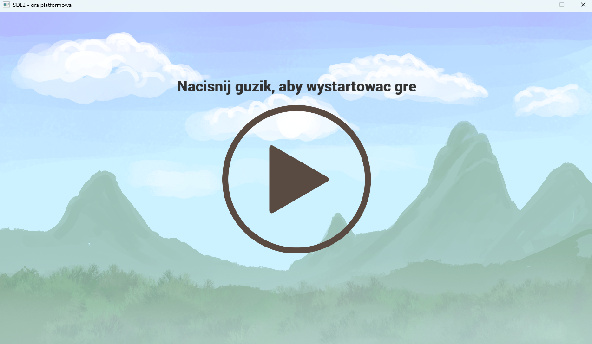
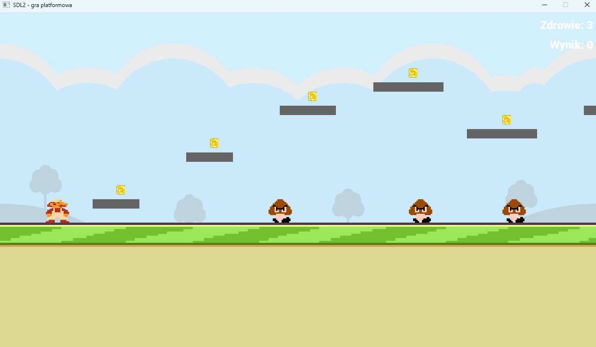
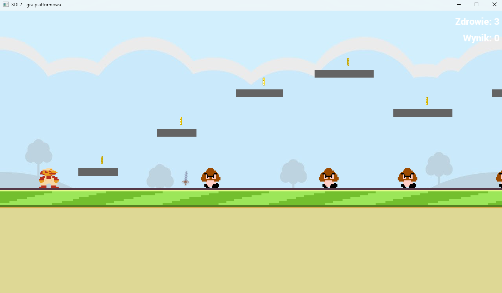
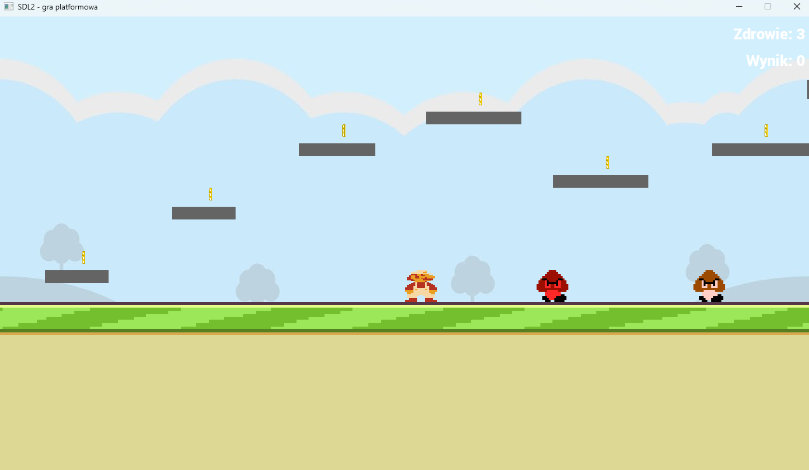
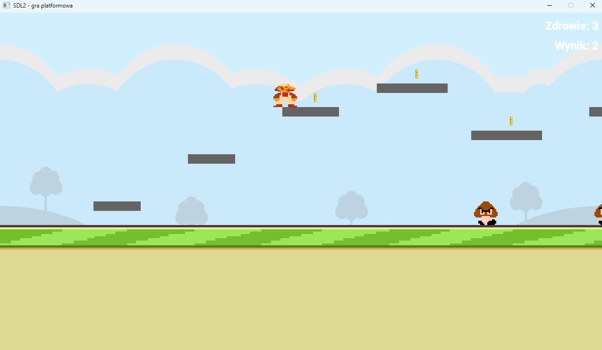
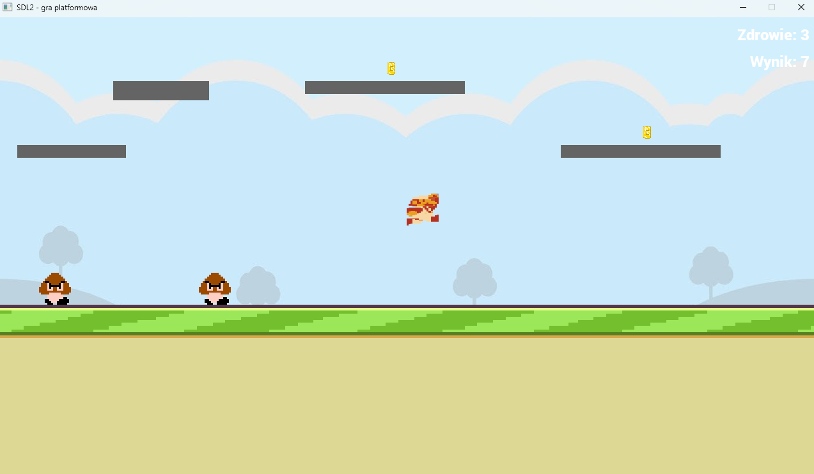
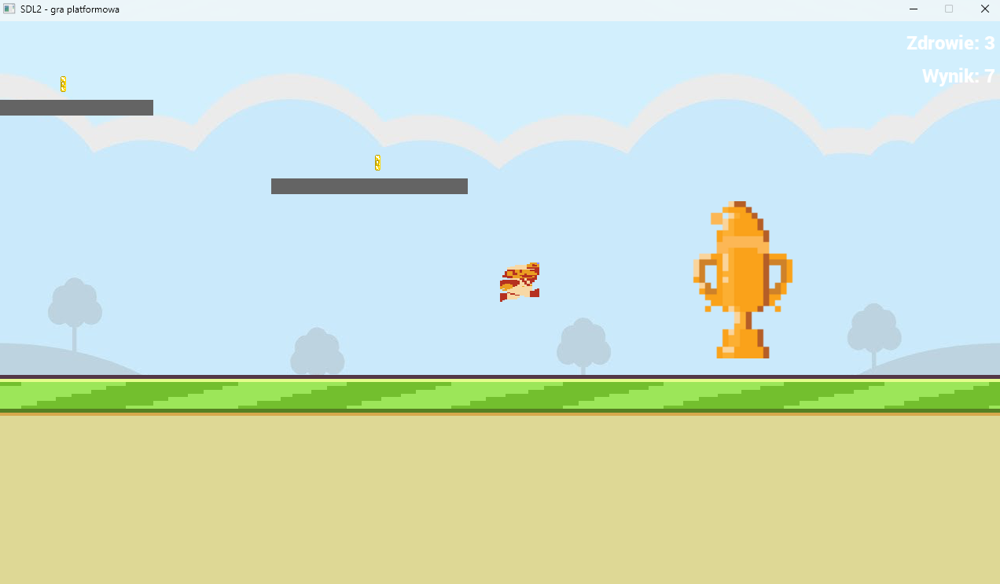
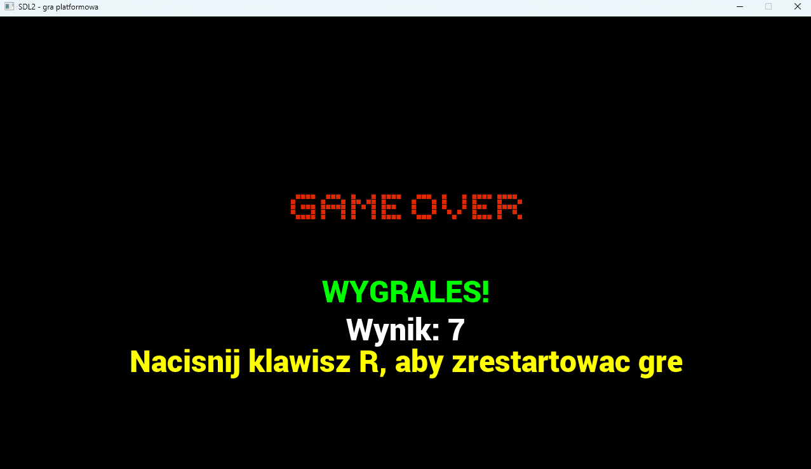

# Gra platformowa stworzona z użyciem biblioteki SDL2

## Opis projektu

Ten projekt to gra stworzona w języku C++ z wykorzystaniem biblioteki **SDL2** – prostej i nowoczesnej biblioteki multimedialnej do tworzenia gier 2D i 3D. Celem projektu było stworzenie kompletnej, uruchamialnej gry z czytelnym kodem oraz modularną strukturą.

---

## Struktura projektu

```
/SDL2-Game
     /src        # Pliki źródłowe
     /assets     # Zasoby: tekstury, dźwieki, czcionki
     /include    # Pliki nagłówkowe
      CMakeLists.txt
```

Projekt oparty jest na systemie budowania **CMake** i wykorzystuje `FetchContent` do automatycznego pobierania zależności (SDL2).

---

## Budowanie projektu

W katalogu `SDL2-Game` wykonaj:

```bash
cmake -B build
cmake --build build
```

Plik wykonywalny zostanie utworzony w podkatalogu `build`.

---

## Uruchamianie gry

Po zbudowaniu projektu uruchom:

```bash
./build/bin/main   # lub main.exe na Windows
```

Gra otworzy się w nowym oknie SDL2 z ustawioną rozdzielczością (domyślna rozdzielczość to 1280x720) i domyślną konfiguracją gry. 

---

## Sterowanie

| Klawisz          | Funkcja                   |
| ---------------- | ------------------------- |
| ← / → (strzałki) | Ruch postaci w lewo/prawo |
| Spacja           | Skok                      |
| Enter            | Atak (broń)               |

---

## Zasady gry

* Celem gry jest **dotarcie do pucharu**, który znajduje się na końcu mapy.
* Po drodze gracz może **zbierać monety**, które pełnią rolę punktów – umieszczone są na platformach wymagających wskoczenia na nie.
* W trakcie gry napotykasz **wrogów** – możesz ich unieszkodliwić za pomocą ataku (klawisz **Enter**).
* Ukończ grę, przechodząc przez wszystkie przeszkody i osiągając cel końcowy.

---

## Zrzuty ekranu z rozgrywki

<div align="center">
  
</div>

<div align="center">
  
</div>

<div align="center">
  
</div>

<div align="center">
  
</div>

<div align="center">
  
</div>

<div align="center">
  
</div>

<div align="center">
  
</div>

<div align="center">
  
</div>

---

## Wymagania

* CMake 3.28+
* Kompilator C++ z obsługą standardu **C++17**
* Nie są wymagane zewnętrzne biblioteki – SDL2 jest pobierany automatycznie.

---

## Informacje dodatkowe

Gra wykorzystuje podstawowe funkcjonalności SDL2, takie jak:

* ładowanie i renderowanie tekstur,
* obsługa dźwieku,
* system zarządzania stanami gry,
* podstawowe elementy UI (przyciski, teksty),
* kontrola wejścia z klawiatury i myszy.

Projekt może być dobrą bazą do dalszej rozbudowy, rozszerzania, testowania innych mechanik lub jako przykład implementacji gry 2D z użyciem SDL2.
